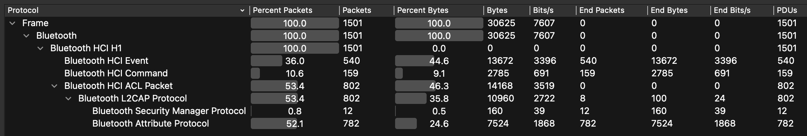

# Bluetooth Discovery and Pairing Trace Analysis Lab

## Introduction

This lab experiment focuses on capturing and analyzing Bluetooth communication during the discovery, scanning, pairing, and data exchange phases. Using a Logitech MX Master mouse as the target device, I collected Bluetooth protocol traces using Apple's PacketLogger tool on macOS Sequoia. The captured btsnoop files were analyzed in Wireshark to examine protocol hierarchies and interaction patterns during device pairing and communication.

## Device Information

### Target Device
- **Device Name**: MX Master  
- **Vendor**: Logitech  
- **Configuration**: Factory defaults  

### Capture Device
- **Operating System**: macOS 15.5 "Sequoia"  
- **Bluetooth Adapter**:  
  - Chipset: BCM_4378  
  - Vendor ID: 0x004C (Apple)  
  - Firmware Version: 22.5.539.3931  

## Tools and Configuration

### PacketLogger Settings
- **Version**: 2024.03.18 (via Xcode Additional Tools)  
    - Downloaded from: [Apple Developer Tools](https://download.developer.apple.com/Developer_Tools/Additional_Tools_for_Xcode_16.3/Additional_Tools_for_Xcode_16.3.dmg) 
- **Logging Profile**: Bluetooth Logging Profile (`Bluetooth_macOS.mobileconfig`)  
    - Downloaded from: [Bluetooth_macOS.mobileconfig](https://download.developer.apple.com/OS_X/OS_X_Logs/Bluetooth_macOS.mobileconfig)
- **Capture Mode**:  
  - Enabled full HCI command/event logging  
  - Disabled syslog capture for cleaner traces 
  - SDP (Service Discovery Protocol) decoding enabled  
- **Output Format**: `.btsnoop` files  

### Wireshark Analysis
- **Filters Applied**:  
  - Advertisement: `bthci_evt.bd_addr == C7:4A:39:BE:64:91`  
  - Scan: `(_ws.col.protocol == "HCI_CMD" || _ws.col.protocol == "HCI_EVT") && (_ws.col.def_src == "host")`
  - Pairing: `bluetooth.addr == C7:4A:39:BE:64:91 && _ws.col.protocol == "SMP"`  
  - Data Exchange: `bluetooth.addr == C7:4A:39:BE:64:91 && _ws.col.protocol == "ATT"`   

## Experimental Procedure

1. **Setup**:  
   - Devices placed within 1m range  
   - Mouse set to discoverable mode via Logitech receiver removal  
2. **Trace Collection Phases**:  
   - **Advertisement**: Captured mouse's advertising packets  
   - **Scan**: Monitored host device scanning for peripherals  
   - **Pairing**: Recorded Secure Simple Pairing (SSP) process  
   - **Data Exchange**: Tracked HID reports during mouse movements  
3. **Post-Processing**:  
   - Filtered and exported phase-specific traces  
   - Applied Wireshark display filters for protocol isolation  

## Protocol Hierarchy Analysis

